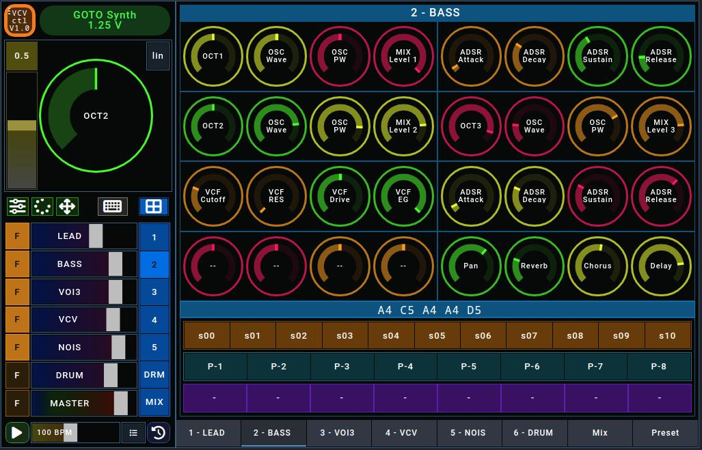

# VCV-CTL

## What is VCV-CTL?

VCV-CTL is a set of files that allow VCV Rack to be controlled with Open stage control.

## What is VCV Rack?

VCV Rack is virtual modular synthesizer platform for Windows/Mac/Linux that simulates Eurorack modules.

More information can be found on the Site of VCV Rack [https://vcvrack.com/](https://vcvrack.com/)

## What is Open Stage Control?

Open Stage Control is software that can be used to create controls that control parameters in music applications.
The OSC protocol is used for this.
The special thing about it is that these elements are made available by an http server. The interface can be loaded from any browser, which allows (touch) operation via a tablet without installing any further software on this device.

More information can be found on the Site of Open Stage Control [http://openstagecontrol.ammd.net/](http://openstagecontrol.ammd.net/)

*If you know VCV Rack and are looking for a controller, you have come to the right place.*

*If you don't know VCV Rack but are still interested in electronic music, learn the basics of VCV Rack first.*

## Parts of VCV-CTL

VCV-CTL consists of two parts:

- a patch for VCV Rack 2
- a JSON definition for Open Stage Control

The patch serves as a template and can be filled with other sound-generating modules.

The JSON definition can be loaded by OpenStageControl and creates a series of controllers, some of which are assigned to the modules already present in the patch.
There are also free controllers that can be assigned to the new modules.

## Features

- Five different synth sections and a drum section.
- 32 controls per section.
- Fine adjustment via a large controller
- 8 presets per section selectable via buttons
- 11 sequences per section selectable via buttons
- Autofade: Controls can be moved using a timer.
- 2 joysticks for moving knobs in Open Stage Control.
- Keyboard for editing sequences in Open Stage Control.
- Grid for editing drum patterns in Open Stage Control.

See the videos on YouTube <a href="(https://www.youtube.com/watch?v=WREZaBIiI4o" target="_blank">Part1</a> and <a href="(https://www.youtube.com/watch?v=jalXA209Crc" target="_blank">Part2</a>

For more information read the [documentation of VCV-CTL](/doc/doc.md)
