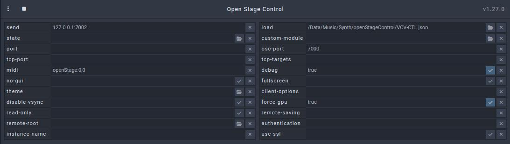

# VCV-CTL

## Parts of VCV-CTL

VCV-CTL consists of two parts:

- a patch for VCV Rack 2
- a JSON definition for Open Stage Control

The patch serves as a template and can be filled with other sound-generating modules.

The JSON definition can be loaded by OpenStageControl and creates a series of controllers, some of which are assigned to the modules already present in the patch.
There are also free controllers that can be assigned to the new modules.

## Features

- Five different synth sections and a drum section.
- 32 controls per section.
- Fine adjustment via a large controller
- 8 presets per section selectable via buttons
- 11 sequences per section selectable via buttons
- Autofade: Controls can be moved using a timer.
- 2 joysticks for moving knobs in Open Stage Control.
- Keyboard for editing sequences in Open Stage Control.
- Grid for editing drum patterns in Open Stage Control.

## Usage

First of all: The Open Stage Control documentation calls a definition file in JSON format a "session file". I find this term confusing and therefore call it a definition file in this documentation.

So load the definition file VCVctl.json into Open Stage Control and set the following parameters:

- send: 127.0.0.1:7002
- midi: openStage:0,0
- osc-port: 7000

Then start the server using the play button. You can now use the control widgets in the Open Stage Control window or you can start a browser (on a tablet) and open the http address. The address is displayed in the Open Stage Control log after startup. The graphic elements contained in the definition file are optimized for a 10-inch tablet in full-screen mode. Full-screen mode can be started using the menu at the top left (three dots).

Then start VCV-Rack and load the patch VCVctl.vcv.

## VCV rack patch.

.. does next to nothing at first and has to be filled with life. It is intended as a basic patch for your own patches.

The patch contains several sections marked with texts. Each section uses a different color for these texts, which can also be found in the Open Stage Control interface. The first five sections are all structured in the same way and are used to build a synth voice by adding modules. For control purposes, each section contains (essentially) the following modules:

- KEY-SEQ as sequencer
- 8FACE to save presets
- OCT to set the octave
- KNOB 5 for control
- MindMeld PatchMaster to adjust pan, reverb, chorus and delay
- MindMeld MasterChannel to display the output level and as a connection element to the mixer.
- BGA VU to display the overall level (x)
- HOT TUNA to display the notes played (x)
- SCOPE to display the output wave (x)

The modules marked with (x) are not necessarily needed, but are quite useful.

Section 2 has the special feature that it has 3 OCT modules to set the octave for different VCOs. If this is also required for other sections, these can be expanded in the same way. In addition to the synth sections 1-5, there is the drum section, which contains an 8-channel trigger sequencer instead of a sequencer and also some drums. The MIX section contains the mixer, effects and control elements.

The blue buttons in Open Stage Control allow you to move the modules in VCV Rack to access a specific section. The top button offers the lower buttons in a menu when they are hidden (by the keyboard).

Now press the MIX button to switch to the mixer section.

Here you can set the audio output in the AUDIO module (1) for your soundcard. Then it is very important to set the MIDI device in the MIDI->CV and MIDI-CAT modules to "openStage:midi_out" (2)(3)(4). If you do not want to work with the MIDI keyboard from Open Stage Control, you can also set other devices for MIDI->CV. KEY-SEQ works with two keyboards: one for note input (4) and one for control (3).

Then click on the values ​​display in Open Stage Control.

This is connected to the SEND button of the OSC'ELOT module via MIDI-CAT. Switching OSC'ELOT on and off causes all of the module's settings to be sent to Open Stage Control via OSC. The elements are then labeled with the module names and parameter names of VCV Rack.

If you assign or remove new knob controllers via OSC'ELOT, these will usually be transferred to Open Stage Control. However, if the names of parameters are changed in VCV Rack (for example, the name of a channel in MixMaster), this will not happen. In this case, all labels can be re-transferred using this refresh button.

## Add modules and create a voice

To do this, switch to a (free) synth section (at the beginning everything is free except for the DRUMS)

- Create the voice using the desired modules.
- Connect OCT/OUT to the V/OCT input of the added modules (1).
- Connect KEY-SEQ/Gate to the GATE input of the added modules (2).
- Connect the audio output of the modules to the MasterChannel/IN input (3) (use two cables for stereo).

Now the modules are connected to the KEY-SEQ and the output is connected to the MixMaster module. Next you can enter a sequence.

## Enter a sequence

KEY-SEQ can be controlled using one or two keyboards. One is used to enter notes or to enter a command by pressing two keys. The second keyboard is used to enter commands and thus replaces the two-key logic. The definition file contains two keyboards for Open Stage Control.

- The keyboard can be opened via a button (1).
- The top row shows the notes of the current sequence (2).
- The buttons below are assigned to the KEY-SEQ commands (3).
- Use the keys of the keyboard below to enter notes at the current position (4).
- The octave can be changed using the arrows on the edge (5).
- The button (6) moves the keyboard down (and back again).
- The button (8) (or (1)) closes it.
- The button (7) displays (and hides) a grid keyboard instead of the normal keyboard.

- Notes can be entered using 7 buttons per octave (1).
- Only notes that fit the scale are included.
- The scale can be adjusted via a menu (2).
- The starting note can be set using the left-right arrows (3).
- The octave can be adjusted using the up-down arrows (4).

If you have entered notes, you should see (on the SCOPE, for example) that they are being played. To hear something, you have to switch on the channel in the mixer by pressing the F button. The volume can be adjusted using the control behind it.

Über die Sequenz-Leiste (1) kann eine andere Sequenz ausgewählt werden ...

und direkt im noch offenen Keyboard bearbeitet werden (2). Die Sequenz wird auch im unteren Bereich (3) angezeigt, wenn das Keyboard geschlossen ist.

## Assigning the Knob Controllers

Close the keyboard so that all controls are visible. Some knob controllers are already assigned in the basic patch (OCT, Pan, Reverb, Chorus, Delay) and can be used immediately. 
The others can be assigned to the new modules to adjust them. To do this, the OSC'ELOT module should be brought into the section. This is easiest if Open Stage Control is operated with a tablet:

- Select Section MIX on the tablet.
- In VCV Rack, click and hold the OSC'ELOT module.
- Select Section 1 (or another if desired) on the tablet.
- Move OSC'ELOT to a free position with the mouse and release the button.

Now the knob controllers can be assigned to the modules:

- In the OSC'ELOT module, scroll down to the bottom of the list of assignments
- Click Unmapped (1).
- First click on the controller in VCV (2).
- Then click on a free knob controller in Open Stage Control (3). The knob controller will be assigned to the parameter in VCV.
- Click the next control in VCV Rack and assign it by clicking a knob controller in Open Stage Control.
- When all controls have been assigned, click in a free area in VCV Rack.

This is particularly quick if you don't use the tablet, but the window provided by Open Stage Control. You can give this window the property "always on top" (this works with Linux Mint with Cinnamon. Maybe for other OS as well) 
and then move it near the VCV modules. After that, all you have to do is click back and forth.

When selecting the controls, it has proven to be a good idea to use the same knob controllers for the same parameters in each synth section. 
For example, CUTOFF could always be on the first knob of the third row and ADSR on the last four of the first row. This makes it easier to find the knobs intuitively.

Read the OSC'ELOT documentary for more information on mapping controls.

## Create presets

After all knob controllers have been assigned, the voice can be adjusted using the Open Stage Control knob controllers. Once a setting that sounds good has been found, it can be saved as a preset. 
However, the new modules must first be assigned to the 8FACE module once.

- In the 8FACE module, click on the menu item "Box visible" so that the assigned modules are marked with a blue frame.
- Then select the menu item "Bind module(select multiple)".
- Now click on each of the new modules to assign it.

To save a setting, follow these steps

- Set the R/W switch in the 8FACE module to "W".
- Click the button and click on the desired slot
- Set the R/W switch in the 8FACE module back to "R".
  
For more information read the 8FACE documentation.

Once some presets have been created, they can be switched using the preset bar in Open Stage Control.

The preset is not switched immediately, but only at the end of the sequence (the BGA S&H module ensures this).

You can now make quite good music just by switching between the presets and sequences. This is especially true when more voices are added. The presets and sequences of all voices can be clearly controlled in the "Preset" tab.

## Configure mixer channel

The creation of the voice is almost complete. Now all that remains is to adjust the mixer channel.

- To do this, switch to the MIX section using the MIX button.
- Give the channel a name (e.g. VC-1).
- Set the desired parameters via the channel menu.

More information can be found in the documentation for the MixMaster module.

Finally, click the Refesh button in Open Stage Control to display the name in the fader.

## Drum-Section

There are a few special features in the drums section. It is already filled with (drum) modules in the basic patch. 
You can of course replace these with others and also the mixer for these modules. In this case, make sure to assign the modules to the 8FACE module and the parameters to the knob controllers of Open Stage Control via OCS'ELOT.

The second special feature is that the trigSeq is used here, which provides several drum patterns instead of a sequence. The patterns can be changed via Open Stage Control. When you click the keyboard button, a grid pattern appears in the drum section instead of a keyboard.

For this to work, not only must the "6-DRUM" tab be active, but the section must also have been activated via the switch (1).

The grid displays 8 channels over 8 rows. Each row is assigned to a channel of trigSeq (2). This channel provides the triggers for one of the drums. 
The triggers can be set/removed by clicking on the grid buttons. If another row is clicked, trigSeq switches to another channel (via an OSC message).

trigSeq offers 64 patterns that can be switched between. The first 11 of these patterns can be switched in Open Stage Control via the pattern bar (3). This switches both the play and edit patterns. This means that the effects of a change can be heard immediately.

Unfortunately, the pattern information is not so easy to transfer to Open Stage Control because trigSeq only ever returns the pattern of the current channel when switching. 
Therefore, when the pattern is changed, the Open Stage Control definition file switches through all channels one after the other. 
Such processes are difficult to synchronize in JavaScript. Therefore, a waiting time is used here, which should be set depending on the performance of the JavaScript engine. More about this can be found in the "Options and customizations" section.

## Clock

The clock can be configured via the bottom line of the sidebar.

The first button is used to start and stop the clock. The fader behind it is intended for continuous adjustment and the menu offers several predefined values. The button on the far right triggers a reset.

## Autofade

The Autofade panel is activated via the Timer button (1) and offers three timers that can move the knob controllers automatically. Each timer is structured in the same way. The only differences are in the values ​​that are set.

The following values ​​can be set:

### Number of passes (2).

1x means that a controller is moved from the start position to the end position. 2x means that it is then moved back to the start. 3x means forward, back and forward again. It continues like this up to 8x.

### Duration (3).

This is the running time in seconds for a complete run of a fader from 0 to max. If a complete run is not defined by the start and end positions, then this time is reduced proportionally.

### Waiting time (4)

Before a controller is moved in the other direction again, the time set here is waited for.

### End position (5)

The knob is moved to this position. Depending on whether the value is in front of or behind the current position, the knob is moved forwards or backwards.

### Start timer

To start a timer, it must first be activated. This happens automatically when one of its values ​​is changed or when the button (5) is clicked. Only one timer can be activated at a time. The others are then deactivated. 
If a timer is active, this is visualized by an orange frame (6) on the settings panel.

To start the activated timer, simply click on one (or more) of the knob controllers. The timer will then start when you let go. 
Since the timer reacts to letting go, it is possible to change the starting value beforehand by moving the knob controller.

Knob controllers that are currently being moved by a timer will be marked (7). It is advisable not to touch this knob controller again until the timer has ended. But of course it is possible to start timers on other knob controllers while others are still running. 
It is also possible to use another timer from the sidepanel.

## Joysticks

The joysticks can be opened using the joystick button (1).

There are two joysticks A and B (2) that can be moved independently of each other. Each joystick can be assigned a knob controller for the X-axis and one for the Y-axis. To do this, click on one of the buttons AX, AY, BX or BY. This starts the "Learn" (3) function. If a knob controller is then clicked, it is assigned to the corresponding axis and can then be moved using the joystick. The name of the controller is entered in the button as a label (4).

## Options and customizations

### Starting Open Stage Control

You can start Open Stage Control manually each time. It can also be started using a script (eg bash under Linux) together with VCV Rack. The necessary options can be specified on the command line.

    open-stage-control --load /Data/Music/Synth/openStageControl/VCV-SIX-SYNTH.json  --send 127.0.0.1:7002 --osc-port 7000 --midi openStage:0,0 &

It is important that the ports and MIDI settings are adopted as they are. These are also set in the base patch. If you are only working with the tablet, you can also add the --no-gui option so that only the server is started on the PC.

## The problem of latency

When using the keyboard with a tablet, there can be a lot of latency due to the fact that WiFi is involved. This latency also exists with the knob controllers, but it is not as noticeable here.

There are two possible solutions:

* Use a monitor with a touchscreen
  - that is connected directly to the PC/laptop via UBS-C or HDMI+USB.
  - You can then slide the Open Stage Control window onto this.
  - The advantage of this solution is that the power of the PC is also used for JavaScript.
  - The downside is that every time you click on the touchscreen, your mouse cursor moves from the main screen to the touchscreen (you only have one mouse cursor).
  - Another disadvantage is that in some cases you need more cables (HDMI+USB+power)
  
* Connect the tablet to the PC/laptop via USB.
  - However, this is not what Open Stage Control is intended to do, as the connection is only possible via http and therefore requires a network.
  - However, there is a thread on the manufacturer's website with possible solutions: Run Touch Server via USB instead of Wifi (external link).
  - I myself have successfully tried the software mentioned in this thread gnirehtet (external link).
  - The disadvantage of this solution is that USB debugging has to be enabled and a second software is necessary.

## Adjustments in the definition file

To do this, Open Stage Control must be switched to edit mode via the menu at the top left (1). All adjustments that are currently useful can be made in the script of the topmost account "root/onCreate". (Rudimentary) JavaScript knowledge is required for this.

### Change identifier

The identifiers for modules and parameters provided by VCV Rack via OSC are often too long. Therefore, the functions

* transModName() - for module names 
* transParamName() - for parameter names

map the identifiers to abbreviations. If other modules are used, these methods must be adapted to the modules by extending the mapping.

### Waiting time when loading drum patterns

As already described above, a trick is used when loading drum patterns. All channels are switched through one after the other, so that in the end the patterns from all channels are sent to Open Stage Control via OSC. Since this can lead to synchronization problems, a waiting time is used between the runs. This waiting time

* can be increased if pattern loading needs to be accelerated and the tablet is fast enough to process the data.
* can be set lower if a slow tablet is used.
  
Basically, you should set the value as low as possible. If you notice that individual channels are missing when switching drum patterns in the grid, then this is a sign that the data is not being processed quickly enough.
In this case, the value should be increased. The value is in the millisPerStep variable of the changeTrowaPattern() function and can be changed there.

*After all changes, the definition file should be saved.*
