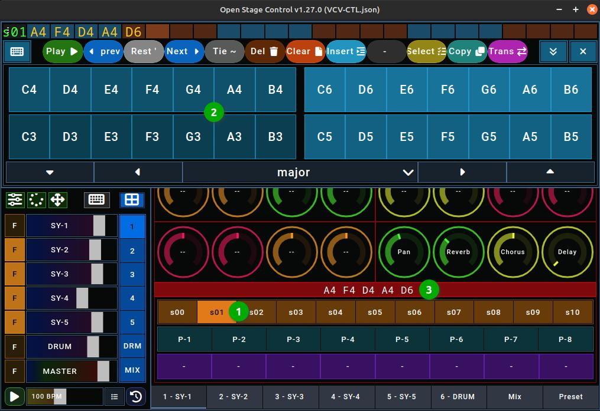

# VCV-CTL

## What is VCV-CTL?

VCV-CTL is a set of files that allow VCV Rack to be controlled with Open stage control.

## What is VCV Rack?

VCV Rack is virtual modular synthesizer platform for Windows/Mac/Linux that simulates Eurorack modules.

## What is Open Stage Control?

Open Stage Control is software that can be used to create controls that control parameters in music applications.
The OSC protocol is used for this.
The special thing about it is that these elements are made available by an http server. The interface can be loaded from any browser, which allows (touch) operation via a tablet without installing any further software on this device.

If you know VCV Rack and are looking for a controller, you have come to the right place.
If you don't know VCV Rack but are still interested in electronic music, learn the basics of VCV Rack first.

## Parts of VCV-CTL

VCV-CTL consists of two parts:

- a patch for VCV Rack 2
- a JSON definition for Open Stage Control

The patch serves as a template and can be filled with other sound-generating modules.

The JSON definition can be loaded by OpenStageControl and creates a series of controllers, some of which are assigned to the modules already present in the patch.
There are also free controllers that can be assigned to the new modules.

## Features

- Five different synth sections and a drum section.
- 32 controls per section.
- Fine adjustment via a large controller
- 8 presets per section selectable via buttons
- 11 sequences per section selectable via buttons
- Autofade: Controls can be moved using a timer.
- 2 joysticks for moving knobs in Open Stage Control.
- Keyboard for editing sequences in Open Stage Control.
- Grid for editing drum patterns in Open Stage Control.

## Usage

Vorab: Die Dokumentation von Open Stage Control nennt eine Definitionsdatei im Json Format ein "session file". Ich finde diesen Begiff verwirrend und nenne res deshalb in dieser Dokumentation Definitionsdatei.

Laden Sie also die Definitionsdatei VCVctl.json in Open Stage Control und stellen Sie folgende Parameter ein:

- send: 127.0.0.1:7002
- midi: openStage:0,0
- osc-port: 7000

Starten Sie dann den Server dann über den Play-Button. Sie können die Elemente jetzt über das Open Stage Control Fenster bedienen oder einen Browser (auf einem anderen Tablet) starten und die http-Adresse öffen. Die Adresse wird nach dem Start im Log von Open Stage Control ausgegeben. Die in der Definitionsdatei enthaltenen grafischen Elemente sind für ein 10 Zoll Tablet im Vollbildmodus optimiert. Der Vollbildmodus kann über das Menu ganz oben links (drei Punkte) gestartet werden.

Starten Sie dann VCV-Rack und laden die den Patch VCVctl.vcv.

## VCV rack patch.

.. does next to nothing at first and has to be filled with life. It is intended as a template for your own patches.

Der Patch enthält mehrere Sektionen, die mit Texten markiert. Jede Sektion verwendet eine andere Farbe für diese Texte, dich sich auch in der Oberfläche von Open Stage Control wiederfindet. Die ersten fünf Sektionen sind alle gleich aufgebaut und diesen dazu, eine Synth-Stimme durch das Hinzufügen von Modulen zu bauen. Zur Steuerung enthält jede Section (im wesentlichen) folgende Module:

- KEY-SEQ als Sequenzer
- 8FACE um Presets speichern
- OCT um die Octave einzustellen
- KNOB 5 zur Steuerung
- MindMeld PatchMaster, um Pan, Reverb, Chorus und Delay einzustellen
- MindMeld MasterChannel, um den Ausgabepegel anzuzeigen und als Verbindungselemet zum Mixer.
- BGA VU um den Gesamtpegel anzuzeigen (x)
- HOT TUNA um die gespielten Noten anzuzeigen (x)
- SCOPE um die Ausgangswelle anzuzeigen (x)

Die mit (x) markierten Module werden nicht unbedingt gebraucht, sind aber ganz nützlich.

Section-2 hat die Besonderheit, dass 3 Oct Module vorhanden sind, um die Oktave für verschiedene VCOs unterschiedlich einzustellen. Wenn das auch für andere Sections benötigt wird, sind diese analog zu erweitern. Neben den Synth-Sections 1-5 gibt es die Drum-Section, die statt eines Sequenzers einen 8 Kanal Trigger-Sequenzer enthält und auch schon einige Drums.
Die Section MIX enthält den Mixer, Effekte und Steuerelemente.

Mit den blauen Buttons von Open Stage Control können Sie die Module in VCV Rack verschieben, um so zu einer bestimmten Sectionen zu gelangen. Der oberste Button bietet die unteren Buttons in einem Menü an, wenn sie (durch das Keyboard) verdeckt sind.

Drücken Sie den Button MIX, um in die Mixer Section zu wechseln.

Hier können Sie den Audio-Ausgang im Modul AUDIO einzustellen (1). Dann ist es ganz wichtig, das MIDI device in den Modulen MIDI->CV und MIDI-CAT  auf "openStage:midi_out" einzustellen (2)(3)(4). Wenn Sie nicht mit dem MIDI Keyboard von Open Stage Control arbeiten wollen, dann können sie für MIDI->CV auch andere Geräte einstellen. KEY-SEQ arbeitet mit zwei Keyboards: eines für die Noteneingabe (4) und eines für die Steuerung (3).

Klicken Sie dann auf das Werte-Display in Open Stage Control.

Dieses ist über MIDI-CAT mit dem SEND Button des Moduls OSC'ELOT verbunden. Das Ein- und Ausschalten von OSC'ELOT bewirkt, dass sämtliche Einstelllungen des Moduls über OSC an Open Stage Control gesendet werden. Danach sind die Elemente mit Beschriftungen aus VCV Rack versehen.

Wenn Sie neue Knob-Controller über OSC'ELOT zuweisen oder welche entfernen, dann werden diese in der Regel auch zu Open Stage Control übertragen. Wenn jedoch die Bezeichnungen von Reglern in VCV Rack geändert werden (zum Beispiel der Name eines Kanals in MixMaster), dann passiert das nicht. In diesem Fall können alle Beschriftungen durch diesen Refesh-Button neu übertragen werden.

## Module hinzufügen und eine Stimme erstellen

Wechseln Sie hierzu in eine (freie) Synth-Section (Am Anfang sind bis auf die DRUMs alle frei).

- erstellen Sie mit den gewünschen Modulen die Stimme.
- verbinden Sie OCT/OUT mit dem V/OCT Eingang der hinzugefügen Module (1)
- verbinden Sie KEY-SEQ/Gate mit dem GATE Eingang der hinzugefügen Module (2)
- verbinden Sie den Audio Ausgang der Module mit dem MasterChannel/IN Eingang (3) (zwei Kabel für Stereo).

Jetzt ist sind die Module mit dem KEY-SEQ verbunden und der Ausgang hängt am MixMaster Modul. Als nächstes können Sie eine Sequenz eingeben.

## Sequenz eingeben

KEY-SEQ kann über ein oder zwei Keyboards gesteuert werden. Eines dient zur Eingabe von Noten oder beim Drücken von zwei Tasten zur Eingabe eines Kommandos. Das zweite Keyboard dient zu Eingabe von Kommandos und ersetzt somit die zwei-Tasten-Logik. In der Definitionsdatei sind zwei Keyboards für  Open-Stage-Control enthalten.

- Das Keyboard kann über einen Button geöffnet werden (1).
- In der obersten Reihe werden die Noten der aktuellen Sequenz dargestellt (2).
- Die Buttons darunter sind den Kommandos von KEY-SEQ zugeordnet (3).
- Mit den Tasten lassen sich an der aktuellen Position Noten eingeben (4).
- Über die Pfeile am Rand lässt sich die Oktave ändern (5).
- Der Button (6) verschiebt das Keyboard nach unten (und auch wieder zurück).
- Der Button (8) (oder auch (1)) schließt es wieder.
- Über den Button (7) wird statt des normalen Keyboards ein Grid-Keyboard eingeblendet (und auch wieder aus).

- Noten können über 7 Buttons pro Oktave eingeben werden (1).
- Es sind nur Noten enthalten, die zur Scale passen.
- Die Scale kann über ein Menü (2) eingestellt werden.
- Über die links-rechts Pfeile kann die Anfangsnote eingestellt werden (3).
- Über die hoch-runter Pfeile kann die Oktave eingestellt werden (4).

Wenn Sie Noten eingegeben haben, dann sollten Sie (am SCOPE zum Beispiel) sehen, dass diese gespielt werden.
Damit Sie auch was hören, müssen sie den Kanal im Mixer anschalten, indem sie den Button F drücken.
Über den Regler dahinter kann die Lautstärke eingestellt werden.

Über die Sequenz-Leiste (1) kann eine andere Sequenz ausgewählt werden ...

und direkt im noch offenen Keyboard bearbeitet werden (2). Die Sequenz wird auch im unteren Bereich (3) angezeigt, wenn das Keyboard geschlossen ist.

## Zuweisen der Knob-Controller

Schließen Sie das Keyboard, damit alle Regler sichtbar sind. Einige Knob-Controller sind bereits durch den Basispatch belegt (OCT, Pan, Reverb, Chorus, Delay) und können sofort verwendet werden. Die anderen können den neuen Module zugewiesen werden, um diese einzustellen. Dazu sollte das Modul OSC*ELOT in die Section gebracht werden. Das geht am eimfachsten, wenn Open Stage Control mit einem Tablet bedient wird:

- Section MIX auf dem Tablet auswählen.
- In VCV Rack das Modul OSC'ELOT anklicken und festhalten.
- Section 1 (oder wenn gewünscht eine andere) auf dem Tablet auswählen.
- OSC'ELOT mit der Maus an eine freie Position schieben und Taste loslassen.

Jetzt können die Knob-Controller den Modulen zugewiesen werden:

- Im Modul OSC'ELOT in der Liste der Zuweisungen ganz nach unten scrollen
- Unmapped anklicken (1).
- Zuerst Regler in VCV anklicken (2).
- Dann einen freien Knob-Controller in Open Stage Control anklicken (3). Der Knob-Controller wird dem in VCV Parameter zugewiesen.
- Nächsten Regler in VCV anklicken und durch Anklicken eines Knob-Controllers in Open Stage Control zuweisen.
- Wenn alle Regler zugewiesen wurden, in einen freien Bereich in VCV Klicken.

Besonders schnell geht das, wenn dazu nicht das Tablet verwendet wird, sondern das von Open Stage Control bereitgestellte Fenster.
Diesem kann man die Eigenschaft "immer im Vordergrund geben" (bei Linux Mint mit Cinnamon geht das. Für andere OS vielleicht auch) und es dann in die Nähe der VCV Module schieben. Danach muss man nur noch hin und her klicken.

Bei der Auswahl der Regler hat es sich als sinnvoll erwiesen, für die gleichen Parameter in jedem Synth-Bereich die gleichen Knob-Controller zu verwenden. CUTOFF könnte zum Beispiel immer auf dem ersten Knob der dritten Reihe liegen und ADSR auf den letzten vier der ersten Reihe. Das erleichtet das intuitive Wiederfinden der Knobs.

Hier kann es nicht schaden, sich mal die Doku von OSC'ELOT anzuschauen.

## Presets erstellen

Nach dem alle Knob-Controller zugewiesen wurden, kann die Stimme über die Controller von Open Stage Control eingestellt werden. Wenn eine gut klingende Einstelllung gefunden wurde, dann kann diese als Preset gespeichert werden. Vorher müssen jedoch die neuen Module dem 8FACE Modul einmalig zugeordnet werden.

- Im Modul 8FACE den Menüpunkt "Box visible" anklicken, damit die zugeordneten Module mit einem blauen Rahmen markiert werden.
- Dann den Menüpunkt "Bind module(select multible)" auswählen.
- Jetzt jedes der neuen Module anklicken, um es zuzuordnen.

Um eine Einstelllung zu speichern, dann folgende Schritte ausführen

- Schalter R/W im Module 8FACE auf "W" stellen.
- Button anklicken, dem den gewünschten Slot anklicken
- Schalter R/W im Module 8FACE wieder auf "R" stellen.

Auch hier hilft die Doku von 8FACE weiter.

Wurden einige Presets erstellt, dann können sie mit der Preset-Leiste in Open Stage Control umgeschaltet werden.

Das Preset wird nicht sofort umgeschaltet, sondern erst am Ende der Sequenz (dafür sorgt das BGA S&H Modul).

Alleine mit dem Umschalten der Presets und der Sequenzen lässt sich jetzt schon ganz gut Musik machen. Erst recht, wenn weitere Stimmen dazukommen. Die Presets und Sequenzen alle Stimmen können im Reiter "Preset" übersichtlich gesteuert werden.

## Mixerkanal konfigurieren

Das Erstellen der Stimme ist damit fast abgeschlossen. Jetzt ist nur noch der Mixerkanal anzupassen.

- Wechseln Sie dazu über den Button MIX in die MIX-Section.
- Geben Sie dem Kanal einen Namen (zB VC-1).
- Stellen Sie über das Menü des Kanals die gewünschen Parameter ein.

Mehr dazu ist in der Doku zum Modul MixMaster zu finden.

Zum Schluss klicken Sie den Refesh Button in Open Stage Control, damit der Name in dem Fader angezeigt wird.

## Drum-Section

In der Drums-Section gibt es einige Besonderheiten. Sie ist bereits im Basispatch mit (Drum-)Modulen gefüllt. Diese können Sie natürlich durch andere ersetzen und auch den Mixer für diese Module. Achten Sie in diesem Fall darauf, die Module dem 8FACE Modul zuzuweisen und die Parameter über OCS'ELOT den Knob-Controllern von Open Stage Control.

Die zweite Besonderheit besteht darin, dass hier der trigSeq verwendet wird, der statt einer Sequenz mehrere Drumpattern bereitstellt. Die Pattern können über Open Stage Control geändert werden. Beim Anklicken des Keyboard-Buttons geht in der Drum-Section ein Grid-Pattern statt eines Keyboards auf.

Damit das funktioniert, muss nicht nur der Reiter "6-DRUM" aktiv sein, sondern die Section muss über den Schalter aktiviert worden sein (1).

Das Grid bildet 8 Kanäle über 8 Zeilen ab. Jede Zeile ist einem Kanal von trigSeq zugeordnet (2). Dieser Kanal liefert die Trigger für eine der Drums. Durch Anklicken der Grid-Buttons können die Trigger gesetzt/entfernt werden. Wird eine andere Reihe angeklickt, dann erfolgt die Umschaltung von trigSeq (über eine OSC Message) in einen anderen Kanal.

trigSeq bietet 64 Patterns an, zwischen denen umgeschaltet werden kann. Die ersten 11 dieser Patterns können in Open Stage Control über die Pattern-Leiste umgeschaltet werden (3). Hierbei wird sowohl das Play- als auch das Editpattern umgeschaltet. So sind die Auswirkungen einer Änderung sofort hörbar.

Leider sind die Informationen der Patterns nicht so einfach zu Open Stage Control zu übertragen, weil trigSeq beim Umschalten immer nur das Pattern des aktuellen Kanals liefert. Deshalb werden von der Open Stage Control Definitionsdatei beim Wechseln des Patterns alle Kanäle nacheinander durchgeschaltet. Solche Verfahren sind in JavaScript schwer zu synchronisieren. Deshalb wird hier mit einer Wartezeit gearbeitet, die je nach Leistung der JavaScript-Engine eingestellt werden sollte. Mehr dazu is im Abschnitt "Anpassungen" zu finden.

## Clock

Die Clock kann über die unterste Zeile der Sidebar konfiguriert werden.

Der erste Button dient zum Starten und Stoppen der Clock. Der Fader dahinter ist stufenlosen Einstellung vorgesehen und das Menü bietet mehrere vordefinierte Werte an. Der Button ganz rechts löst einen Reset aus.

## Autofade

Das Autofade-Panel wird über den Timer-Button (1) aktiviert und bietet drei Timer an, die die Knob-Controller automatisch bewegen können. Jeder Timer ist gleich aufgebaut. Die Unterschiede bestehen nur in den Werten, die eingstellt werden.

Folgende Werte können eingestellt werden:

### Anzahl Durchläufe (2).

1x bedeutet, das ein Controller von der Anfangsposition bis zu Endpostion bewegt wird. 2x bedeutet, dass er danach wieder zurück zum Anfang bewegt wird. 3x bedeutet vor, zurück und wieder vor. So geht es weiter bis zu 8x.

### Laufzeit (3).

Dies ist die Laufzeit in Sekunden für einen *kompletten* Durchlauf eines Faders. Wird durch die Anfangs- und Endpostition kein kompletter Durchlauf festgelegt, dann wird diese Zeit proportional herunter gerechnet.

### Wartezeit (4)

Bevor ein Controller wieder in die andere Richtung bewegt wird, wird die hier eingestellte Zeit abgewartet.

### Endpostion (5)

Auf diese Position wird der Knob bewegt. Je nachdem ob die der Wert vor oder hinter der aktuellen Position befindet, wird der Knob vorwärts oder rückwärts bewegt.

### Timer starten

Um einen Timer zu starten muss er zuvor aktiviert werden. Das passiert automatisch, wenn einer seiner Werte geändert wird oder wenn der hintere Button (5) angeklickt wird. Es kann immer nur ein Timer aktiviert werden. Die anderen werden dann deaktiviert. Ist ein Timer aktiv, dann wird das durch einen orangen Rahmen (6) für das Einstellung-Pannel visualisiert.

Um den aktivierten Timer dann zu starten, ist einfach einer (oder mehrere) der Knob-Controller anzuklicken. Der Timer wird dann beim *Loslassen* gestartet. Da hier auf das Loslassen reagiert wird, besteht die Möglichkeit den Startwert durch Bewegen des Knob-Controllers vorher zu ändern.

Knob-Controller, die gerade von einem Timer bewegt werden, werden in der Darstellung geändert (7). Es ist ratsam, diesen Knob-Controller erst wieder anzufassen, wenn der Timer bendet wurde. Aber natürlich ist es möglich, Timer auf anderen Knob-Controllern zu starten, während andere noch laufen. Auch das Wechseln des Timers ist möglich.

## Joysticks

Die Joysticks können über den Joystick-Button (1) geöffnet werden.

Es gibt zwei Joysticks A und B (2), die unabhängig voneinander bewegt werden können. Jedem Joystick kann ein Knob-Controller für die X-Achse und einer für die Y-Achse zugewiesen werden. Dazu ist einer der Buttons AX, AY, BX oder BY anzuklicken. Das startet die "Learn" (3) Funktion. Wird danach ein Knob-Controller angeklickt, dann wird dieser der entsprechenden Achse zugewiesen und kann danach über den Joystick bewegt werden. Der Name des Reglers wird in den Button als Beschriftung eingetragen (4).

## Optionen und Anpassungen

### Starten von Open Stage Control

Man kann Open Stage Control jedesmal von Hand starten. Es kann aber auch über ein Script (zB bash unter Linux) zusammen mit VCV Rack gestartet werden. Die notwendigen Optionen können auf der Kommandozeile mitgegeben werden.

    open-stage-control --load /Data/Music/Synth/openStageControl/VCV-SIX-SYNTH.json  --send 127.0.0.1:7002 --osc-port 7000 --midi openStage:0,0 &

wichtig ist, dass die Ports und die MIDI-Einstelllung so übernommen werden. Diese sind auch so im Basispatch eingestellt.
Wenn nur mit dem Tablet gearbeitet wird, dann kann zusätzlich die Option --no-gui aufgenommen werden, so auf dem PC nur der Server gestartet wird.

## Das Problem der Latenzen

Bei der Verwendung des Keboards mit einem Tablet kann es zu großen Latenzen kommen, die damit zusammenhängen, dass WLAN im Spiel ist. Diese Latenzen gibt es auch bei den Knob-Controllern, aber hier fallen sie nicht so stark auf.

Hier gibt es zwei Lösungsmöglichkeiten:

* Verwenden eines Monitors mit Touchscreen, der über UBS-C oder HDMI+USB direkt an den PC/Laptop angeschlossen wird. Auf diesem kann man dann das Open Stage Control Fenster schieben.

* Anschließen des Tablets über USB an den PC/Laptop.

Das ist so jedoch nicht von Open Stage Control vorgesehen, da die Verbindung nur über http geht und somit zwingend ein Netzwerk erfordert. Aber auf den Seiten des Herstellers gibt es einen Thread mit Lösungsmöglichkeiten: Run Touch Server via USB instead of Wifi (externer Link).
Ich selbst habe erfolgreich die in diesem Thread erwähnte Software gnirehtet (externer Link) ausprobiert.

## Anpassungen in der Definitionsdatei

Dazu ist Open Stage Control über das Menü oben links (1) in den Editmodus zu schalten. Alle zur Zeit sinnvollen Anpassungen können im Script des obersten Kontens "root/onCreate" vorgenommen werden. Hierfür sind (rudimäntäre) JavaScript Kenntnisse notwendig.

### Bezeichner ändern

Die Bezeichner für Module und Parameter, die von VCV Rack über OSC geliefert werden, sind oft zu lang. Deshalb werden über die Funktionen

transModName() - für Modulnamen
transParamName() - für Parameternamen

die Bezeichner auf Abkürzungen gemapped. Werden andere Module verwendet, dann sind diese Methoden auf die Module anzupassen, indem das Mapping erweitert wird.

### Wartezeit beim Laden von Drum-Pattern

Wie schon oben beschrieben wird beim Laden von Drum-Pattern mit einem Trick gearbeitet. Hier werden alle Kanäle nacheinander durchgeschaltet, so dass am Ende die Pattern von allen Kanälen über OSC an Open Stage Control gesendet werden. Da es dabei zu Synchronisationsproblemen kommt, wird mit einer Wartezeit zwischen den Durchläufen gearbeitet. Diese Wartezeit

* kann hochgesetzt werden, wenn das Laden von Pattern beschleunigt werden soll und das Tablet schnell genug ist, um die Daten zu verarbeiten.
* kann herunter gesetzt werden, wenn ein langsames Tablet verwendet wird.

Grundsätzlich sollte man einen möglichst neidrigen Wert einstellen. Fällt auf, dass beim Umschalten von Drum-Pattern im Grid immer einzelne Kanäle fehlen, dann ist das ein Anzeichen dafür, dass die Daten nicht schnell genug verarbeitet werden. In diesem Fall ist der Wert hochzusetzen. Der Wert steht in der Variablen  millisPerStep der Funktion changeTrowaPattern() und kann dort verändert werden.

*Nach allen Veränderungen sollte die Definitionsdatei gespeichert werden.*

